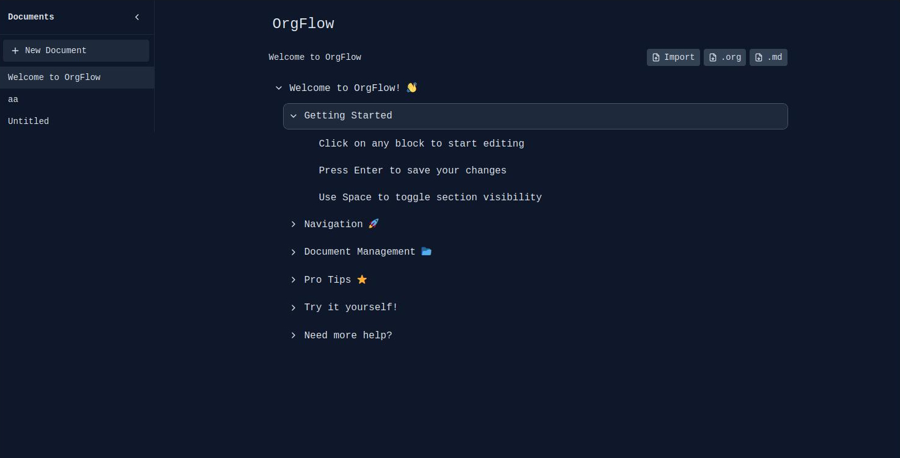

# OrgFlow

OrgFlow is a modern, keyboard-driven outliner application inspired by Org Mode. It provides a clean and intuitive interface for creating and managing hierarchical documents with collapsible sections.


[Screenshot placeholder - Add screen.jpg to show the application interface]

## Features

- 📝 Hierarchical document organization
- 🎯 Keyboard-driven interface
- 📦 Automatic content persistence
- 🔄 Collapsible sections
- ⌨️ Rich keyboard shortcuts
- 🎨 Modern, clean interface

## Installation

1. Clone the repository
2. Install dependencies:
```bash
npm install
```
3. Start the development server:
```bash
npm run dev
```

## Usage

### Keyboard Shortcuts

- `Enter` - Edit current block
- `Space` - Toggle block visibility (when block has children)
- `Tab` - Indent block
- `Shift + Tab` - Unindent block
- `↑` - Navigate to previous block
- `↓` - Navigate to next block
- `Escape` - Cancel editing
- `Enter` (while editing) - Save changes

### Block Operations

- Click on any block to edit its content
- Use the chevron icons to collapse/expand sections
- Navigate through blocks using keyboard shortcuts
- Indent/unindent to create hierarchical structures

## Technology Stack

- React
- TypeScript
- Vite
- Tailwind CSS
- Lucide Icons

## Storage

OrgFlow automatically saves your content to localStorage, ensuring your documents persist between sessions.

## Development

To build for production:
```bash
npm run build
```

To preview the production build:
```bash
npm run preview
```